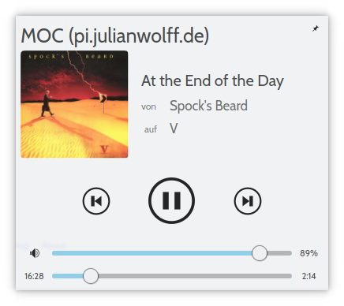

# MPRIS2 bridge for MOC - music on console



## Install

```
# mkdir -p /usr/lib/systemd/user/
# mkdir -p /usr/lib/moc-mpris/

# install -D -m644 *.service /usr/lib/systemd/user/
# install -D -m755 *.sh /usr/lib/moc-mpris/
# install -D -m755 *.py /usr/lib/moc-mpris/
```

Arch Linux users might want to install `moc-mpris-git` from AUR instead.

To enable MPRIS2 support for local instances of MOC:

```
$ systemctl enable --user --now moc_mpris.service
```

To enable MPRIS2 support for remote instances of MOC:

```
$ systemctl enable --user --now moc_mpris@'user@remote'
```

You will need to set up a password-less ssh connection to the remote for this to work (e.g. by using a RSA key, adding the key's password to your wallet, and calling `ssh-add` at startup).
